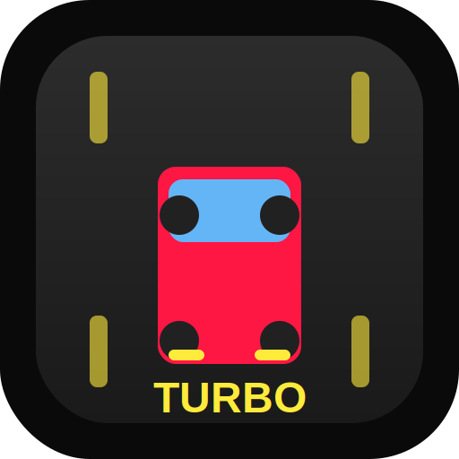

# 🏎️ Turbo Racer - Drive & Survive

An engaging, mobile-friendly car driving game built with Next.js. No login required - just open and play!



## 🎮 Features

- **Instant Play**: No login or registration needed
- **Engaging Gameplay**: Dodge obstacles, collect coins, and beat your high score
- **Progressive Difficulty**: Game speed increases as you progress
- **PWA Support**: Install on your device for offline play
- **Mobile-First Design**: Optimized for both desktop and mobile devices
- **Touch Controls**: Intuitive touch controls for mobile devices
- **Keyboard Controls**: Arrow keys or A/D for desktop
- **Beautiful UI**: Attractive gradients and smooth animations
- **High Score Tracking**: Automatically saves your best score locally

## 🚀 Getting Started

### Prerequisites

- Node.js 18+ installed
- npm or yarn package manager

### Installation

1. Clone the repository:

```bash
git clone <repository-url>
cd self_driving_car
```

2. Install dependencies:

```bash
npm install
```

3. Run the development server:

```bash
npm run dev
```

4. Open your browser and navigate to:

```
http://localhost:3000
```

## 🎯 How to Play

### Desktop Controls

- **Arrow Left** or **A**: Move car left
- **Arrow Right** or **D**: Move car right

### Mobile Controls

- **Touch and Drag**: Swipe left/right to steer the car

### Gameplay

- 🚗 Avoid cars and traffic cones
- 💰 Collect coins for bonus points (+50 points per coin)
- 🏁 Pass obstacles to increase your score (+10 points per obstacle)
- ⚡ Game speed increases every 20 obstacles

## 📱 Installing as PWA

### On Mobile (iOS/Android)

#### iOS (Safari)

1. Open the game in Safari
2. Tap the Share button
3. Select "Add to Home Screen"
4. Tap "Add"

#### Android (Chrome)

1. Open the game in Chrome
2. Tap the menu (three dots)
3. Select "Add to Home Screen" or "Install App"
4. Tap "Add"

### On Desktop (Chrome/Edge)

1. Open the game in Chrome or Edge
2. Look for the install icon in the address bar
3. Click "Install"

## 🏗️ Project Structure

```
self_driving_car/
├── app/
│   ├── layout.tsx          # Root layout with PWA config
│   ├── page.tsx            # Main game page
│   ├── globals.css         # Global styles
│   └── register-sw.tsx     # Service worker registration
├── components/
│   ├── GameCanvas.tsx      # Main game logic and rendering
│   ├── StartScreen.tsx     # Start screen UI
│   └── GameOverScreen.tsx  # Game over screen UI
├── public/
│   ├── manifest.json       # PWA manifest
│   ├── sw.js              # Service worker
│   ├── icon-192.png       # App icon (192x192)
│   └── icon-512.png       # App icon (512x512)
└── README.md
```

## 🛠️ Built With

- **Next.js 14** - React framework
- **TypeScript** - Type safety
- **Tailwind CSS** - Styling
- **HTML5 Canvas** - Game rendering
- **Service Workers** - PWA support

## 🎨 Game Mechanics

### Scoring System

- **Passing an obstacle**: +10 points
- **Collecting a coin**: +50 points

### Difficulty Progression

- Base speed increases every 20 obstacles
- Maximum speed cap to ensure playability
- Obstacle spawn rate: Every 1.5 seconds
- Coin spawn rate: Every 2 seconds

### Collision Detection

- Rectangle-based collision for obstacles
- Circle-based collision for coins
- Precise hit boxes for fair gameplay

## 🔧 Development

### Build for Production

```bash
npm run build
```

### Start Production Server

```bash
npm start
```

### Lint Code

```bash
npm run lint
```

## 📝 Future Enhancements

- [ ] Convert SVG icons to PNG for better compatibility
- [ ] Add sound effects and background music
- [ ] Implement multiple car skins
- [ ] Add power-ups (shield, magnet, etc.)
- [ ] Create different road environments
- [ ] Add leaderboard (requires backend)
- [ ] Add achievement system
- [ ] Implement car customization

## 🐛 Known Issues

- Icons are currently SVG files renamed as PNG (works in most browsers)
  - For production, convert to actual PNG using: `npm run generate-icons`

## 📄 License

This project is open source and available under the MIT License.

## 🤝 Contributing

Contributions, issues, and feature requests are welcome!

---

**Enjoy the game! Try to beat your high score! 🏆**
